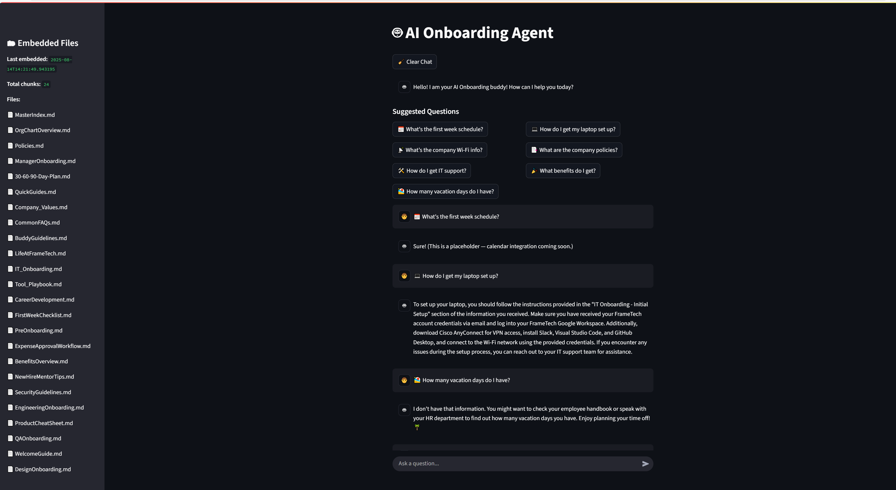

# 🤖 AI Onboarding Agent

An AI-powered onboarding assistant for new **employees** and **partners**, built with Python, LangChain (or CrewAI), and OpenAI. This agent helps users navigate onboarding materials, schedule intro calls, and access internal documentation via a natural language interface.

Designed for modern, distributed teams that need a scalable, always-available digital buddy.

---

## 🌟 Features

| Capability                  | Description                                                               |
|----------------------------|---------------------------------------------------------------------------|
| 🔍 Document Q&A            | Ask questions like “How do I set up VPN?” and get answers from internal docs |
| 📅 Scheduling Integration  | Schedule intro meetings with managers or teams via Google Calendar         |
| 💬 Slack or Web UI         | Chat with the agent through Slack or a browser UI (Streamlit/FastAPI)      |
| 📚 Multi-Agent Support     | Separate agents for search, scheduling, guidance (CrewAI or LangChain agents) |
| 🧠 Contextual Memory       | Optional memory for ongoing conversations or user history                  |
| 🧪 Modular Design          | Easily add new integrations (e.g. Jira, Salesforce, Notion)                |

---

## 🧠 Use Cases

### 👩‍💼 Employee Onboarding
> “Where do I request access to our code repository?”  
> “Show me our Q3 engineering OKRs.”  
> “Schedule a call with João for team introduction.”

### 🤝 Partner Onboarding
> “What’s the process to register a customer POC?”  
> “Link me to the Product X configuration guide.”  
> “Send the updated sales deck for Energy clients.”

---

## 🧩 Architecture

[User Input]
↓
[GuideAgent] → [DocSearchAgent] (FAISS/Pinecone + Docs) -> [SchedulerAgent] (Google/Outlook API)

- **GuideAgent**: Handles initial queries, routes to other agents
- **DocSearchAgent**: RAG over onboarding documentation
- **SchedulerAgent**: Interfaces with calendars
- **(Optional)** ActionAgent: Automates workflows (send emails, set up repos, etc.)

---

## 🛠️ Tech Stack

- **Language**: Python 3.10+
- **AI Framework**: LangChain
- **LLM Provider**: OpenRouter + Google Gemini
- **Vector DB**: FAISS
- **UI**: Slack Bot (via Bolt or Flask - To Be Done) or Streamlit
- **Scheduler**: Google Calendar API or Microsoft Graph (To Be Done)

---

## 🚀 Getting Started

### 1. Clone the repo
```bash
git clone https://github.com/your-username/ai-onboarding-agent.git
cd ai-onboarding-agent
```

### 2. Set Up Environment
```
python -m venv venv
source venv/bin/activate  # or venv\Scripts\activate on Windows
pip install -r requirements.txt
cp .env.example .env  # Fill in your API keys and config
```

### 3. Embed Onboarding Docs
* Place your documents (PDF, Notion exports, markdown) into /data/docs
* Run the embedding script to populate the vector store
```
python load_docs.py
```

### 4. Run the App
```
streamlit run app.py
# OR
python app.py  # if using FastAPI
```

## 📸 Demo (Coming Soon)




## 🗺️ Roadmap
- [X] Document RAG integration

- [X] Slack or Streamlit interface

- [ ] Calendar scheduling integration

- [ ] Add memory or history tracking

- [ ] Deployment (Streamlit Cloud or Hugging Face Spaces)

## 🧑‍💻 Author
João Silva
[LinkedIn](https://linkedin.com/in/jnorsilva) | [Substack](https://wirelessinthemaking.substack.com) | [joaogpt](https://chatgpt.com/g/g-6887987cc5a08191a3f54d021112e713-joaogpt)

## 📄 License
MIT License. Use, fork, improve — and don’t forget to give credit if this helped!
